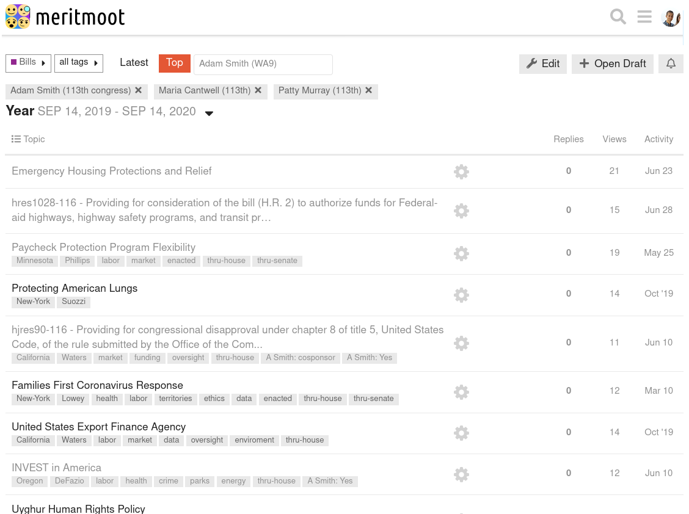
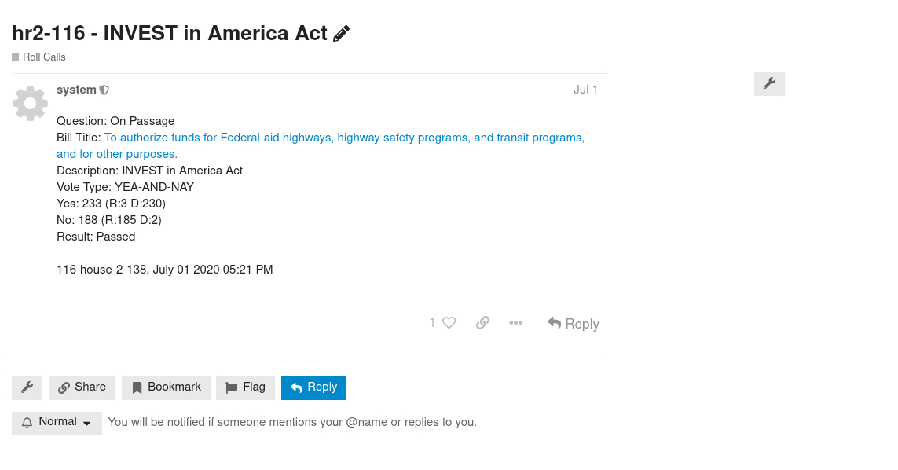
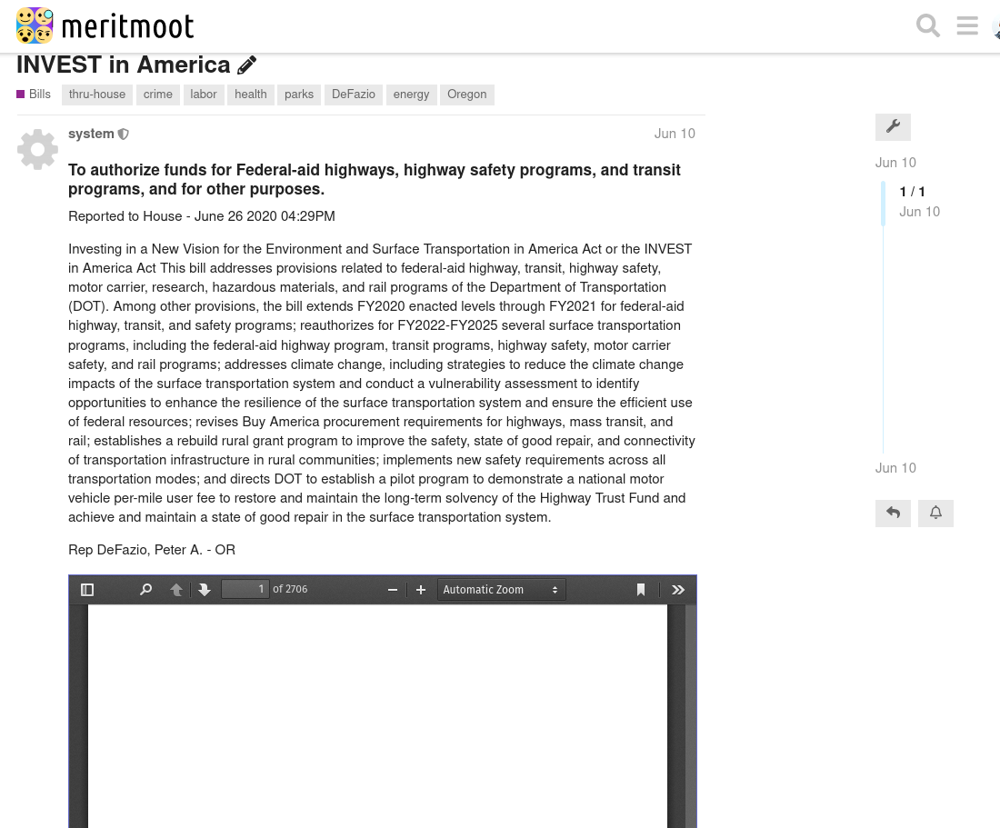
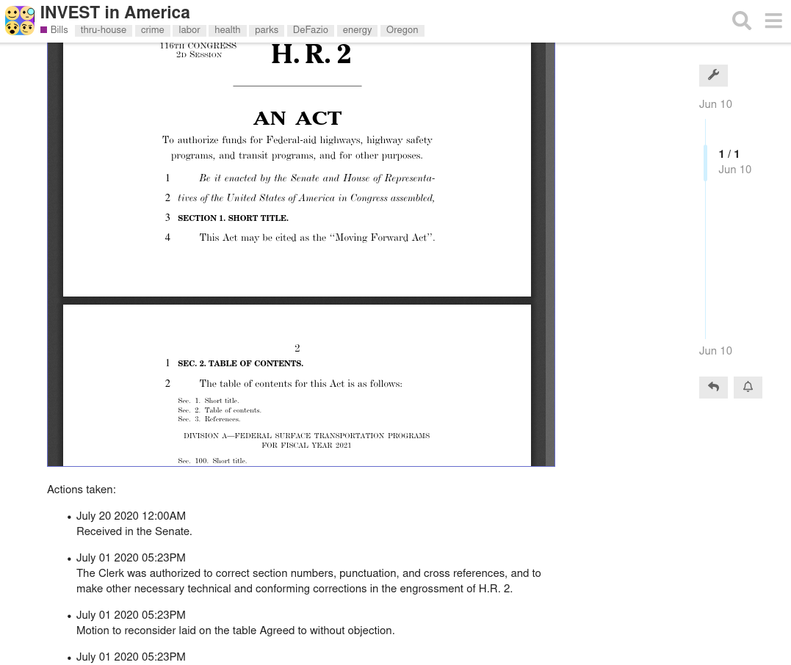

# meritmoot

meritmoot was a project dedicated to providing a platform for policy discussion on the internet. The project is still ongoing, but has pivoted in a diffrent direction away from the base technology it utilized, [discourse](https://www.discourse.org/). Meritmoot was a plugin for discourse, and will be reborn one day as meritfront.com.

The idea of meritmoot was to provide a platform for:
  - organized and localized political discussion and information within a state
  - national political discussion
  - bill and roll call information
  - while utilizing all the benefits of [discourse](https://www.discourse.org/)
  
As I learnt more about ruby on rails, I realized that it was not feasible to continue with meritmoot as it was. Discourse is an amazing platform, but it was not compatible with my end vision for the site, which needed more flexibility. I am thankful for the open and helpful [discourse community](meta.discourse.org) for all the help they provided. Through this time I learnt alot about ruby on rails, and I am continuing to learn with my side project [toonrail](https://github.com/LukeClancy/toonrail), in preperation for my next attempt.

## features
Main screen with site information:

Bill category with topic tags and chosen representative votes / sponsorships, representatives added using the textbox at the top which matches text with representative choices:

An example Roll Call with a link to its bill:

An example bill page with Summary and an iframe with the bill inside:

... bill continues

## Installation

I wouldn't suggest it as it is unstable. but if so, look at: [Install a Plugin](https://meta.discourse.org/t/install-a-plugin/19157) and other posts on [meta](meta.discourse.org). Rather, I would suggest looking at certain sections of the code for reference when doing similar bulk-api activities, or activites to do with discourse. If you still want to, send me a message and I will update the installation instructions, and some of the code base, for more general use. To be clear, I am no longer working on this code base.

## Feedback

If you have issues or suggestions for the plugin, I would appreciate you sending me a message!
