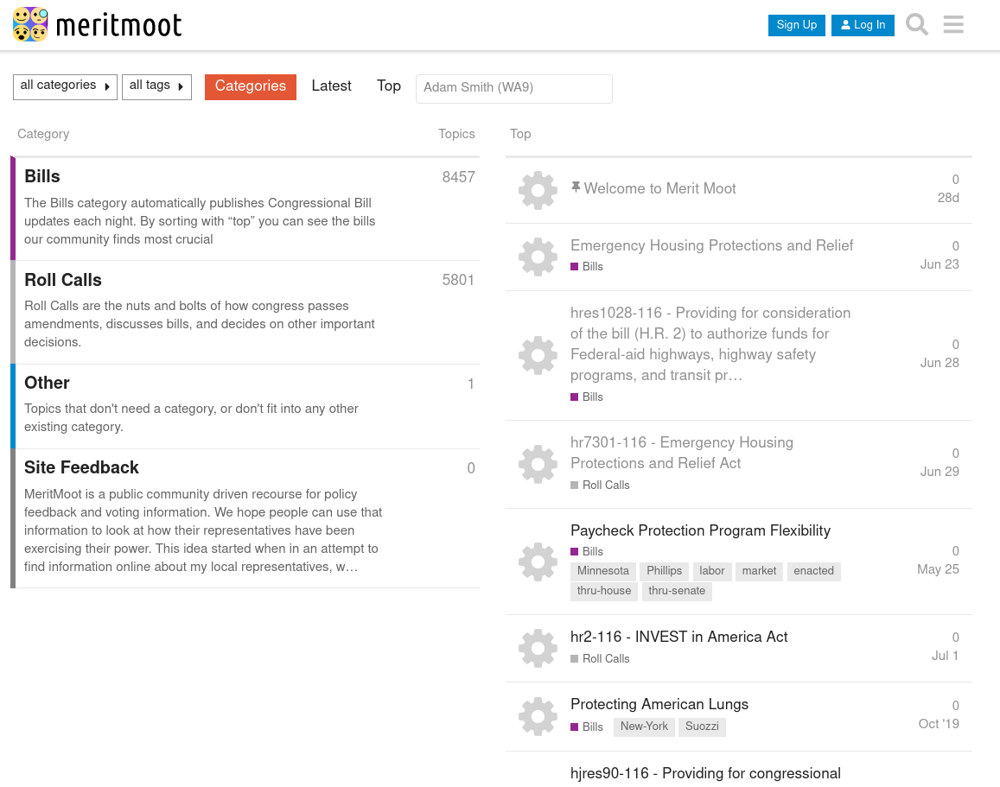
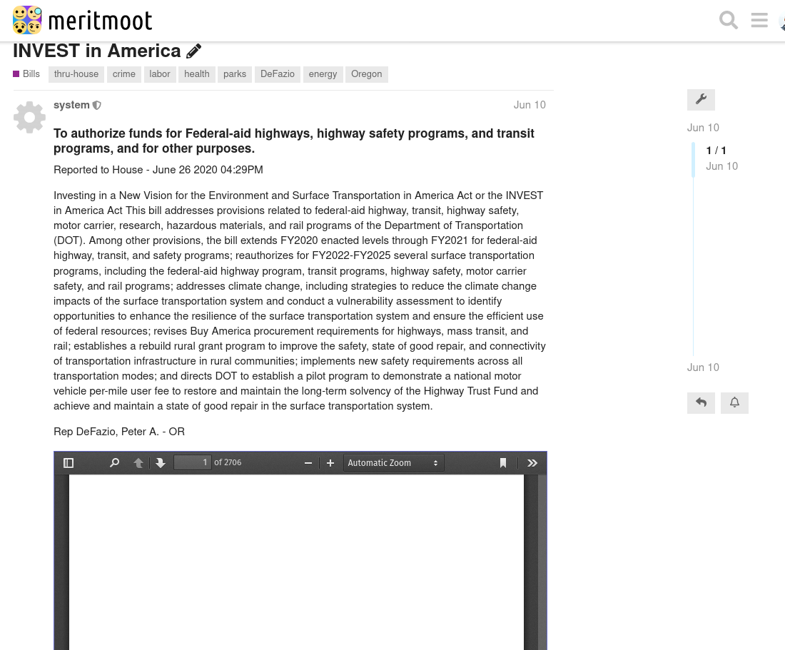
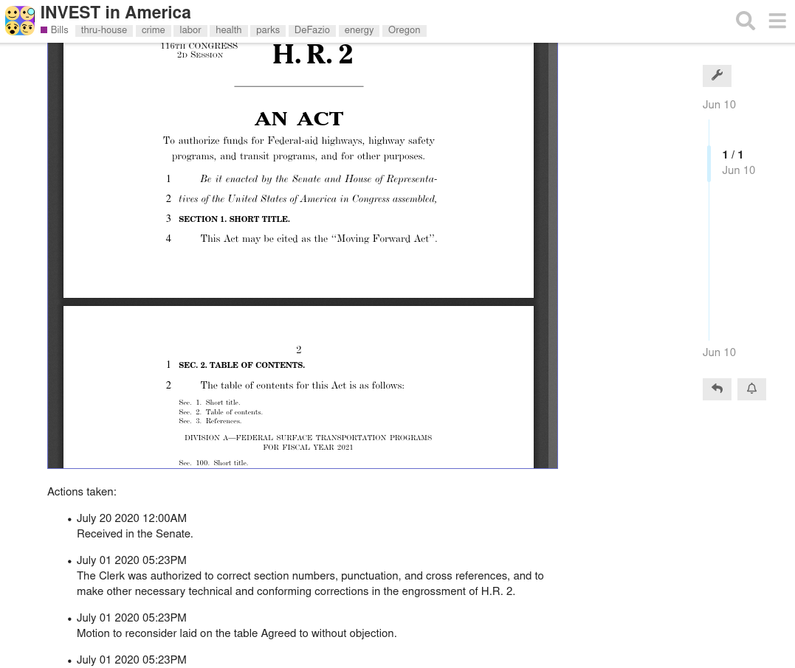

#

meritmoot is an ongoing project dedicated to providing a platform for policy discussion on the internet. The platform provides an interface to access and comment on governmental data such as bills, votes and roll calls for the US house and senate.

To summarize meritmoot provides a platform for:

· local state based political discussion and information

· national political discussion and information

· bill and roll call information

· social and public discussion between users

· allows for decentralized organization of pollical groups.

The website is currently down as we are pivoting away from being a [discourse](https://www.discourse.org/) plugin. This is due to the wish to include more advanced features and views. Discourse, while an amazing platform, does not provide the flexibility needed for my vision of meritmoot V2.

If you are interested, I am experimenting with new ways of implementation with my current side project [toonrail](https://github.com/LukeClancy/toonrail).

## features
This is the main screen with site information:

This s the Bill category with topic tags and the selected representatives (in grey under the text box). This shows their related votes and sponsorships (seen in tags)

An example Roll Call with a link to its bill:

An example bill page with Summary and an iframe with the bill inside:

## Installation

I wouldn't suggest using this version as I am using a new one

## Feedback

If you have issues or suggestions for the plugin, I would appreciate you sending me a message!
